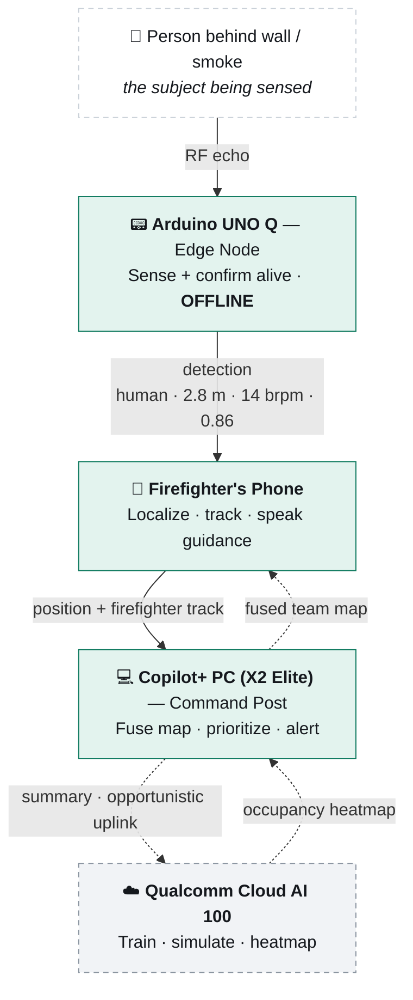

<div align="center">

# 🔥 Vision-X

### Finding living people through smoke, walls, and darkness — and giving rescue teams a hands-free sense in zero visibility.

[](https://github.com/HoneyBadger-010/Vision-X-Through-Wall)
[](https://www.qualcomm.com/)
[](docs/PROPOSAL.md)
[](LICENSE)

**Multi-device AI · AI PC · Mobile · Arduino UNO Q · Qualcomm Cloud AI 100**

</div>

---

> **The question that decides everything inside a fire:**
> *Is there a living person behind this barrier, where exactly, and is there still time —*
> *answered **before** the firefighter commits to breaching the door.*

Vision-X is a four-device AI system that helps firefighters and rescue teams locate living people through smoke, interior walls, and darkness — and **confirm they are alive** — using impulse ultra-wideband (IR-UWB) radar, distributed intelligence, and hands-free spoken guidance. It does not replace the thermal camera; it adds the **see-through-the-barrier, is-it-alive** sense the camera lacks.

---

## 📑 Contents

- [The 30-second version](#-the-30-second-version)
- [The problem](#-the-problem)
- [The solution — one principle](#-the-solution--one-principle)
- [System architecture](#-system-architecture)
- [The four devices](#-the-four-devices)
- [How it works](#-how-it-works)
- [AI / ML pipeline & toolchain](#-ai--ml-pipeline--toolchain)
- [Tech stack](#-tech-stack)
- [Repository structure](#-repository-structure)
- [Demonstration plan](#-demonstration-plan)
- [Datasets](#-datasets)
- [Feasibility & challenges](#-feasibility--challenges)
- [Novelty & prior art](#-novelty--prior-art)
- [Roadmap](#-roadmap)
- [Getting started](#-getting-started)
- [Team](#-team)
- [References](#-references)
- [License](#-license)

---

## ⚡ The 30-second version

| | |
|---|---|
| **What** | A see-through-walls "is-it-alive" sense for firefighters, distributed across four Snapdragon-class devices. |
| **How** | IR-UWB radar passes through smoke and walls; on-device AI confirms a living person from the millimetre motion of breathing. |
| **Why multi-device** | One capability is split so each device does **only what that device can** — and **every tier keeps working if the one above it loses connectivity**. |
| **The demo** | Smoke machine, a closed door, a hidden person → the firefighter pauses at the threshold and hears *"living person, ~2 m, behind this door, breathing"* before breaching. |
| **Why it's low-risk** | Every ingredient (through-wall UWB vitals, RF localization, on-device AI) is independently proven. **The integration is the contribution.** |

---

## 🚨 The problem

Inside a burning building, a firefighter's best perception tool is the **thermal imaging camera** — but it has two blind spots that kill:

- **It is line-of-sight.** It cannot see through a closed door, a wall, or a floor.
- **It reads _heat_, not _life_.** A hot appliance or a just-vacated spot looks like a person; a person behind a barrier looks like nothing.

Optical cameras and LiDAR are defeated by smoke entirely. So the decisive question — *is there a living person behind this barrier?* — goes unanswered at the exact moment it matters most.

**Radio frequency answers what heat and light cannot.** Smoke is effectively transparent to radio, UWB penetrates interior walls and doors, and radar can detect the **millimetre chest motion of breathing**. The same RF that finds trapped civilians also finds a **downed colleague** — and loss of situational awareness inside structures is tied to a large share of the dozens of firefighter line-of-duty deaths each year.

---

## 💡 The solution — one principle

> **Push every decision to the lowest device that can make it, and ensure each tier keeps working if the one above it disappears.**

That single design rule produces the entire architecture *and* its strongest argument.

- **Data shrinks as it climbs** the stack — a raw radar echo becomes a detection, then a position, then a building-wide picture — while **intelligence grows**.
- The result is **graceful degradation**:
  - the **node** finds a victim with **no network**,
  - the **phone** guides one firefighter with **no command post**,
  - the **PC** coordinates a building with **no internet**,
  - the **cloud** links sites only when a backhaul exists.

Disaster zones force exactly this property — and it happens to be the precise **distributed edge-to-cloud AI** story this hardware is built for. **Every device is non-substitutable because of *where the intelligence has to live*, not because it was added for effect.**

---

## 🏗 System architecture

Four tiers, from the physical world up to the cloud. Each arrow carries a **more abstract product** than the one below it; two refined products flow back **down**.



> **Read the diagram:** solid arrows are always-available local links; dashed arrows are opportunistic. Each tier runs even if the tier above it is unreachable. A higher-fidelity rendering of every figure lives in [`docs/images/`](docs/images/) and the full [design document](docs/DESIGN.md).

<div align="center">
  
</div>

---

## 🧩 The four devices

| Tier | Device | Job — and why nothing else can do it |
|------|--------|--------------------------------------|
| **Edge node** | **Arduino UNO Q** *(Dragonwing QRB2210 + STM32U585)* | Carries the IR-UWB radar. The **STM32 captures radar frames on a hard real-time clock**; the **Dragonwing MPU runs on-device AI** (clutter removal + small CNN) and emits a compact detection. **Raw RF never leaves the board.** An autonomous detector that works in a burning structure with **no network**. |
| **Mobile** | **Firefighter's phone** *(worn on SCBA/chest)* | Fuses radar sweeps with its own IMU to **localize the victim**, tracks the firefighter's **own path** by dead reckoning, and runs a small **on-device LLM** that speaks guidance into the comms (a gloved, masked firefighter can't read a screen). Also shows **every teammate's live position**. |
| **AI PC** | **Copilot+ PC (X2 Elite)** *(Hexagon NPU)* | The incident-command brain at the scene — private, internet-free. Fuses **every** responder and **every** detection into one live building map, **pushes the team picture back to every phone**, raises the **downed-firefighter alarm**, and writes the commander's situation report. Many-to-one fusion is what a single moving phone structurally cannot do. |
| **Cloud** | **Qualcomm Cloud AI 100** | The heavy, building-scale work: **trains/improves** the edge models (OTA), and from a building blueprint runs **structural-collapse + fire-spread simulation** to predict a **heatmap of where people are likely trapped**. **Non-blocking** — with no uplink the system uses the last precomputed heatmap and loses nothing critical. |

Full role write-ups: [`node/`](node/) · [`mobile/`](mobile/) · [`pc/`](pc/) · [`cloud/`](cloud/)

---

## ⚙️ How it works

### 1. Seeing through smoke and walls
The radar emits ultra-wideband pulses and reads the reflections. Radio at these frequencies passes through smoke and common non-metallic walls and doors, and the human body reflects it. Echo delay gives distance (range bins); a person is found by the **motion** in those bins.

### 2. Detecting breathing — the "is it alive" signal
The radar sweeps rapidly and repeatedly. The chest wall moves a few millimetres with each breath, so the chest's echo **oscillates between sweeps** at the breathing rate (≈0.2–0.5 Hz, i.e. 12–30 breaths/min). A frequency analysis shows a clear peak at the breathing rate. **Static objects produce no such oscillation** — that is how Vision-X tells a person from a hot radiator. Heartbeat is the same idea, smaller and faster (≈0.8–2 Hz), and is a stretch goal.

<div align="center">
  
</div>

### 3. The motion problem → **detect-then-confirm**
The hardest issue: on a *moving* firefighter, the firefighter's own body motion (centimetres) is **10–100× larger** than the chest's breathing motion (millimetres) and swamps it. Vision-X is designed around this:

- **While advancing**, motion detection gives **direction** ("contact, that way").
- The firefighter **stops at the threshold** for a few seconds; **only during that still dwell is breathing confirmed.**
- Residual sway is removed by **IMU motion compensation** — the accelerometer/gyro measures the sensor's own motion and subtracts it from the radar track (the same approach airborne rescue radar uses for platform drift).
- A **CNN trained on motion-inclusive, IMU-synchronized data** learns the cancellation instead of hand-tuned filters.

### 4. Localizing the victim
One reading gives range, not a position. As the firefighter sweeps from slightly different spots, the phone fuses successive ranges with its IMU to triangulate: *"living person, ~2 m, behind this wall, low to the floor."*

### 5. Tracking the firefighter across the blueprint
Indoors GPS fails, so position comes from **IMU pedestrian dead reckoning** (gyro heading + accelerometer footstep detection, integrated from the entry door = map origin; barometer for floor). Drift is anchored by **zero-velocity updates** at each footfall, **map-matching** to corridors/doors, and optional **UWB anchors** at the entry. This yields a live "where is everyone" view, greys out swept rooms, and gives — for free — a **downed firefighter's last-known location**.

> **Honest accuracy:** a few metres of absolute position over a mission (enough to place a contact in the right room); the **relative victim cue is sub-metre**.

### 6. Data-flow recap
```
raw RF echo (node, real-time)
  → confirmed detection (node MPU, offline)
    → relative position + firefighter track (phone, offline)
      → fused building map + situation report (PC NPU, local)
        → occupancy prediction + multi-site picture (cloud, opportunistic)
```
Two flows run **back down**: the cloud's occupancy heatmap → the PC, and the PC's fused team positions → every phone. Awareness that needs the whole picture is computed **once, centrally**, and distributed.

---

## 🧠 AI / ML pipeline & toolchain

| Where | What runs | Stack |
|-------|-----------|-------|
| **Node** | clutter removal → range-FFT → micro-Doppler / breathing analysis → small **CNN** classifier | Edge Impulse (UNO Q's native TinyML path) or TensorFlow Lite on the Dragonwing MPU; STM32 does real-time capture |
| **Phone** | small **on-device LLM** (e.g. Llama 3.2 3B) for offline spoken guidance, speech in/out | Qualcomm AI Hub → QNN / Genie on the NPU (ONNX is the NPU path on Snapdragon, **not** GGUF) |
| **PC** | sensor-fusion + occupancy prediction, larger **on-device LLM** with retrieval grounded in the floor plan | AnythingLLM on the Hexagon NPU (~45 TOPS), all private / offline-capable |
| **Cloud** | heavier occupancy-likelihood model; *(future)* retraining the edge detector from aggregated data | Qualcomm Cloud AI 100 |

**Toolchain:** Qualcomm AI Hub + `qai_hub_models` (supports Snapdragon X Elite **and X2 Elite** — the award hardware), QNN / QAIRT, the Genie LLM runtime, ONNX Runtime, Edge Impulse, TensorFlow Lite, and Arduino App Lab.

---

## 🛠 Tech stack

**Hardware** — Arduino UNO Q (Qualcomm Dragonwing QRB2210 + STM32U585) · Novelda XeThru X4 (X4M200 / X4M300 / X4F103) IR-UWB radar · 6/9-axis IMU · CO + temperature sensor · Snapdragon Copilot+ PC (X2 Elite) · mobile device · Qualcomm Cloud AI 100.

**Software / AI** — Qualcomm AI Hub · QNN / QAIRT · Genie · ONNX Runtime · Edge Impulse · TensorFlow Lite · Arduino App Lab · AnythingLLM.

**Connectivity** — BLE / Wi-Fi Direct (node ↔ phone) · scene Wi-Fi / mesh (units ↔ PC, two-way) · opportunistic cellular / satellite (PC ↔ cloud).

---

## 📂 Repository structure

```
Vision-X-Through-Wall/
├── README.md                 ← you are here
├── LICENSE
├── CONTRIBUTING.md
├── docs/
│   ├── DESIGN.md             ← full design document (markdown)
│   ├── ARCHITECTURE.md       ← deep architecture & data-flow dive
│   ├── DEMO.md               ← 24-hour demonstration runbook
│   ├── DATASETS.md           ← public datasets + how we use them
│   ├── ROADMAP.md            ← milestones & future scope
│   ├── PROPOSAL.md           ← condensed pitch (for the submission portal)
│   ├── images/               ← architecture / circuit / network / principle SVGs
│   └── Vision-X_design_document.html   ← original print-friendly design doc
├── node/                     ← Arduino UNO Q — edge sensor node (firmware + on-device AI)
├── mobile/                   ← firefighter phone app (localization, tracking, guidance LLM)
├── pc/                       ← Copilot+ PC — incident-command fusion & reasoning
├── cloud/                    ← Qualcomm Cloud AI 100 — training, simulation, heatmap
└── assets/                   ← logos, banners, media
```

> **Status:** this is the **Phase 1** repository. The four tier directories describe the planned implementation and interfaces; code lands during the on-site build (July 11–12, 2026).

---

## 🎬 Demonstration plan

The 24-hour build delivers **one vertical slice**: a single UNO Q with one IR-UWB module detecting presence, distance, and breathing **through a partition**; the phone showing the live cue; the PC showing a fused map with one LLM situation line. The cloud runs as a thin sync stub or a second site on a slide.

> **🔥 The demo moment:** a smoke machine, a partition with a closed door, and a hidden person. The "firefighter" advances with an obscured visor, **pauses at the door**, and — before breaching — gets the hands-free cue *"living person detected, ~2 m, behind this door, breathing,"* while the command-post screen lights up the contact on its map.

The **detect-then-confirm** flow (walk up, pause, sweep) is the real intended workflow, and a genuinely smoke-immune radar makes the demo **authentic rather than simulated**. Full runbook → [`docs/DEMO.md`](docs/DEMO.md).

---

## 📊 Datasets

The detector is pretrained on public IR-UWB data and fine-tuned on-site. Two halves are covered: **detect-through-the-barrier** and **confirm-alive**.

- **Through-wall detection** — a dataset built specifically for victim detection behind walls/obstacles with a UWB radar sensor.
- **Vitals under motion** — `nesl/MobiVital` (IR-UWB chest signals + synchronized IMU + ground-truth respiration) and `RadarDataforCSBHRD` (breathing + heart rate during activity). *These are close-range, line-of-sight, cooperative — pair them with the through-wall set.*
- **Optional gesture control** — `UWB-gestures` (9,600 labelled samples).
- **Index** — `awesome-radar-perception`, a curated hub of radar datasets and detection / domain-adaptation papers.

Details and licensing → [`docs/DATASETS.md`](docs/DATASETS.md).

---

## ✅ Feasibility & challenges

| Challenge | How Vision-X addresses it |
|-----------|---------------------------|
| **Respiration from a moving worn sensor** | detect-then-confirm + IMU motion compensation + a motion-trained CNN; presence + breathing lead, heart rate is a stretch. |
| **Justifying the cloud** | scoped to opportunistic occupancy-likelihood prediction and made **non-blocking**, so it reinforces graceful degradation instead of undermining the offline thesis. |
| **The phone as more than a screen** | it runs localization, firefighter tracking, and the guidance SLM on its NPU; the display is the **output of real compute**. |
| **Firefighter self-localization** | IMU dead reckoning anchored by zero-velocity updates, map-matching, and optional UWB fixes; absolute accuracy claimed at a **few metres**, the relative cue at **sub-metre**. |
| **Downed firefighter** | rides on the same sensors: motion-stop + vitals for detection, last-known trail point for location, UWB homing to reach them through smoke. |

---

## 🌟 Novelty & prior art

The physics is proven (through-wall UWB vital-sign detection), the AI is proven (RF-based pose and localization), and individual pieces of the firefighter stack already exist — **SmokeNav** (mmWave + IMU navigation), **C-THRU** (a thermal see-through-smoke HUD), and **POINTER** (responder tracking). But none of them fuse, as one distributed multi-device system on Snapdragon silicon:

1. commodity **RF that confirms a _living_ victim** through smoke and walls,
2. the **detection AI running on the sensor node itself**,
3. a **hands-free responder unit** that localizes the victim, and
4. a **command-level coordination + occupancy-prediction** layer.

**That integration is the contribution — and it is low-risk precisely because every ingredient is independently validated.**

---

## 🗺 Roadmap

- **Federated, privacy-preserving training** across fire services — shared models improve without centralizing sensitive incident data.
- **3D pose & skeletons** (the RF-Pose direction) — tell a slumped victim from a moving one.
- **Multi-victim simultaneous tracking** and antenna-array imaging for richer through-wall scenes.
- **Heart-rate during stationary dwells** as signal processing matures.
- **Integration with building systems** — fire-safety panels, pre-plans, dispatch / CAD.
- **Productization** — heat-hardened enclosure, ruggedization, field certification.
- **Adjacent applications** — earthquake search-and-rescue, privacy-preserving elder-care fall detection, secure presence sensing.

Full milestone plan → [`docs/ROADMAP.md`](docs/ROADMAP.md).

---

## 🚀 Getting started

> The hands-on build happens during the on-site round. Each tier has its own setup guide:

| Tier | Setup |
|------|-------|
| Edge node (Arduino UNO Q) | [`node/README.md`](node/README.md) |
| Mobile app | [`mobile/README.md`](mobile/README.md) |
| Command-post PC | [`pc/README.md`](pc/README.md) |
| Cloud | [`cloud/README.md`](cloud/README.md) |

---

## 👥 Team

**HoneyBadger** — Snapdragon Multiverse Hackathon, Bengaluru 2026.

| Role | Member |
|------|--------|
| Team Lead | _TBD_ |
| Edge / firmware | _TBD_ |
| Mobile / AI | _TBD_ |
| PC / fusion | _TBD_ |
| Cloud / ML | _TBD_ |

> _Update this table with team member names and GitHub handles._

---

## 📚 References

Selected prior art grounding the feasibility and novelty claims — full list in [`docs/DESIGN.md`](docs/DESIGN.md#references).

- Zhao et al., **"Through-Wall Human Pose Estimation Using Radio Signals" (RF-Pose)**, CVPR 2018, MIT CSAIL.
- Adib et al., **"WiTrack: 3D Tracking via Body Radio Reflections,"** USENIX NSDI 2014.
- Adib & Katabi, **"See Through Walls with WiFi,"** ACM SIGCOMM 2013.
- **"Ultra-Wideband Impulse Radar Through-Wall Detection of Vital Signs,"** Scientific Reports 2018.
- Chen et al., **"SmokeNav,"** Advanced Intelligent Systems 2024.
- Qwake / DHS S&T **C-THRU**; NASA JPL / DHS S&T **POINTER**.

---

## 📄 License

Released under the [MIT License](LICENSE).

<div align="center">

---

*Vision-X — accuracy figures are honest engineering estimates; production deployment requires ruggedization and certification.*

**Built for the Snapdragon Multiverse Hackathon · Bengaluru 2026**

</div>
