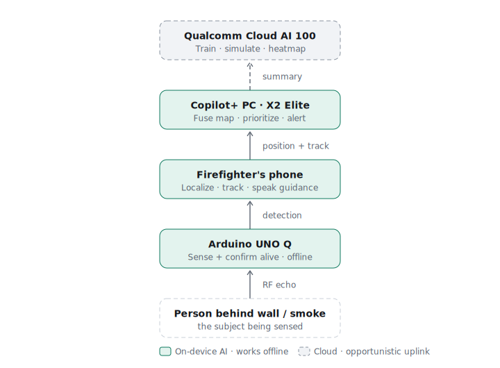
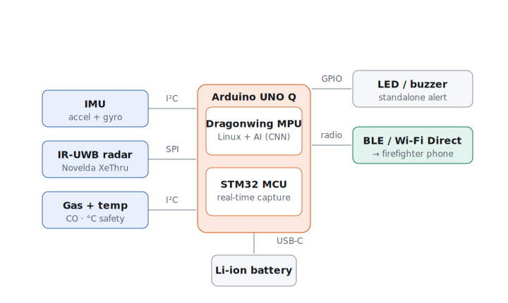
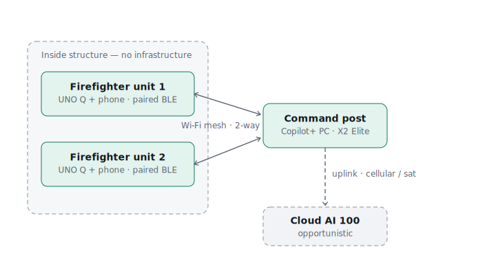
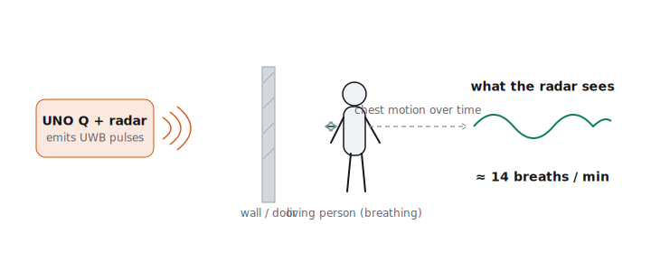

# Vision-X — Design Document

> **Finding living people through walls, across rooms, and smoke — and giving rescue teams a hands-free sense in zero visibility.**
>
> Snapdragon Multiverse Hackathon · Bengaluru — Phase 1 project submission
> Devices: AI PC · Mobile · Arduino UNO Q · Qualcomm Cloud AI 100

A print-friendly HTML version of this document is at [`Vision-X_design_document.html`](Vision-X_design_document.html).

## Contents

1. [Abstract](#1-abstract)
2. [The problem](#2-the-problem)
3. [Solution & core principle](#3-solution--core-principle)
4. [System architecture](#4-system-architecture)
5. [Device roles](#5-device-roles)
6. [Peripherals & circuit](#6-peripherals--circuit-connections)
7. [Connection network](#7-connection-network)
8. [How it works](#8-how-it-works)
9. [AI / ML pipeline & toolchain](#9-ai--ml-pipeline--toolchain)
10. [Datasets](#10-datasets)
11. [Demonstration plan](#11-demonstration-plan)
12. [Feasibility & challenges](#12-feasibility--challenges-addressed)
13. [Novelty](#13-novelty)
14. [Future scope](#14-future-scope)
15. [References](#15-references)

---

## 1. Abstract

Vision-X is a multi-device AI system that helps firefighters and rescue teams locate living people through walls, across rooms, and smoke, and confirm they are alive — before entering.

It distributes one capability across four devices, each doing only what that device can. An **Arduino UNO Q** carries an impulse ultra-wideband (IR-UWB) radar that penetrates interior walls, doors, and floors — sensing into the next room — and passes straight through smoke; it runs on-device AI to confirm a living person from breathing motion and works fully offline. A **mobile device** worn on the firefighter localizes the victim, tracks the firefighter's own path across the building, speaks guidance hands-free into their comms, and shows where every teammate is. A **Snapdragon Copilot+ PC** at the command post fuses every responder and detection into one live building map, predicts where people are likely trapped, and raises a downed-firefighter alarm. **Qualcomm Cloud AI 100** trains the edge models and, from the building's blueprint, simulates collapse and fire spread to predict a heatmap of where people are likely trapped — and coordinates multiple teams when an uplink exists. Each tier keeps working if the one above it loses connectivity — the reality of disaster response, and a direct demonstration of distributed edge-to-cloud AI.

---

## 2. The problem

Inside a burning building, a firefighter's best perception tool is the thermal imaging camera — but it is line-of-sight (it cannot see through a wall, a closed door, or a floor) and it reads *heat*, not *life*, so a hot appliance or a just-vacated spot can look like a person. Optical cameras and LiDAR are defeated by smoke entirely. The question that decides everything in a fire is simple: **is there a living person behind this wall, in the next room, where exactly, and is there still time** — answered before the firefighter commits to entering.

Radio frequency answers the two things heat and light cannot: UWB penetrates interior walls, doors, and floors — so it senses a person in the next room before the firefighter enters — it passes straight through smoke, and the radar can detect the millimetre chest motion of breathing. Vision-X does not replace the thermal camera — it adds the see-through-walls, is-it-alive sense the camera lacks. Firefighter line-of-duty deaths remain in the dozens per year in major fire services, a large share tied to loss of situational awareness inside structures; the same RF that finds civilians also finds a downed colleague.

---

## 3. Solution & core principle

The design rule that produces both the architecture and its strongest argument: **push every decision to the lowest device that can make it, and ensure each tier keeps working if the one above it disappears.** Data shrinks as it climbs the stack — a raw radar echo becomes a detection, then a position, then a building-wide picture — while intelligence grows. The result is **graceful degradation**: the node finds a victim with no network, the phone guides one firefighter with no command post, the PC coordinates a building with no internet, and the cloud links sites only when a backhaul exists. Disaster zones force exactly this property, and it happens to be the precise distributed-edge-AI story the hardware is built for. Every device is non-substitutable because of *where the intelligence has to live*, not because it was added for effect.

---

## 4. System architecture

Four tiers, from the physical world up to the cloud. Each arrow carries a more abstract product than the one below it.

  

> **Figure 1** — System architecture. Data abstracts upward; intelligence grows upward; each tier runs even if the tier above it is unreachable.

---

## 5. Device roles

### 5.1 — Arduino UNO Q · the edge sensor node

The UNO Q is a dual-brain board: a Qualcomm Dragonwing QRB2210 microprocessor running full Debian Linux, paired with an STM32U585 real-time microcontroller. In Vision-X it carries the radar and supporting sensors. The **STM32 captures radar frames and sensor data on a hard real-time clock** (timing Linux cannot guarantee), while the **Dragonwing MPU runs the on-device AI** — clutter removal plus a small neural network — and emits a compact detection such as `human · 2.8 m · breathing 14/min · conf 0.86`. Raw RF never leaves the board. This is what makes the node non-substitutable: it is an autonomous detector that works in a burning structure with no network, not a radio that streams data elsewhere.

### 5.2 — Mobile device · the hands-free mobile brain

Worn on the firefighter's SCBA or chest and paired directly to the node over BLE / Wi-Fi Direct, so firefighter-plus-node is a self-contained unit. It performs real compute: it fuses successive radar sweeps with its own IMU to localize the victim relative to the responder, tracks the firefighter's own position across the building by dead reckoning, and runs a small on-device language model that turns a detection into a spoken cue piped into the comms — because a gloved, masked firefighter in heavy smoke cannot read a screen. The display is the output of that work, not a mirror of the PC. It also receives the fused **team picture from the command post** and shows each teammate's live position relative to the wearer — so firefighters can see one another inside the smoke, coordinate coverage, and move toward a colleague in trouble.

### 5.3 — Copilot+ PC (X2 Elite) · the incident-command brain

The heavyweight tier, running on the Hexagon NPU at the scene — private and internet-free. Where the phone handles one firefighter, the PC fuses *every* responder and *every* detection into one live building map — and **pushes that team picture back down to every firefighter's phone**, so each responder sees where their teammates are. It raises a downed-firefighter alarm and runs a larger on-device language model that writes the commander's situation report and answers queries such as "how many alive on the second floor?". Many-to-one fusion plus command reasoning is the job a single moving phone structurally cannot do.

### 5.4 — Qualcomm Cloud AI 100 · heavy analytics, simulation & training

The cloud carries the workloads too heavy for the edge and the work that benefits from building-scale data.

- **Background / pre-incident:** it trains and continually improves the edge detection models from data aggregated across incidents and pushes them back as OTA updates; and for a registered building it builds a risk model — running structural-failure and fire-spread simulations over the blueprint (building on established simulation methods rather than reinventing them) to estimate how the structure may collapse and where fire travels.
- **The output is a predicted heatmap over the blueprint:** the likely locations of trapped and buried occupants and the priority zones to search first, weighting occupancy patterns, collapse-prone areas, and fire spread.
- **During an incident,** when the command vehicle has an uplink, the cloud serves that heatmap and continuously refines it with the live detections rising from the field, and resolves the ambiguous faint signals the edge cannot.

It stays **non-blocking**: with no uplink the system uses the last precomputed heatmap plus live detections and loses nothing critical — so the heavy cloud role reinforces, rather than breaks, the offline-first design.

---

## 6. Peripherals & circuit connections

All sensing peripherals attach to the UNO Q. The real-time sensors are read by the STM32 over its physical interfaces; the Dragonwing MPU handles AI and the wireless link.

  

> **Figure 2** — Edge node: sensors connect to the UNO Q (STM32 captures in real time; the MPU runs AI and the wireless link). Interfaces labelled.

| Peripheral | Interface | Role / function |
|------------|-----------|-----------------|
| IR-UWB radar — Novelda XeThru X4 (X4M200 respiration / X4M300 presence; X4F103 dev kit) | `SPI / USB` | Penetrates walls, doors, and floors (and smoke); provides presence, motion, range, and respiration. **Core sensor.** |
| IMU (6/9-axis accel + gyro, optional magnetometer; foot-mounted variant) | `I²C / Qwiic` | Sweep motion-compensation, victim localization, and firefighter dead-reckoning across the floor plan. |
| Gas + temperature sensor (CO, °C) | `I²C / Qwiic` | Atmosphere and flashover safety — is the void safe to enter. |
| USB thermal / IR camera (optional) | `USB-C` | Visible-and-smoke layer fused with the radar; the modality the camera still adds. |
| On-board LED matrix / buzzer | `GPIO` | Standalone "contact detected" indicator — the node works even with no phone attached. |
| Li-ion battery pack | `USB-C 5V` | Portable power (board peaks ≈4.5 W), hours of runtime. |

> **Alternatives** to the XeThru radar if needed: SensorLogic `SLMX4` (used by several public datasets), or Acconeer pulsed-coherent modules (cheaper, but better suited to thin partitions than thick walls). Production also needs a heat-hardened enclosure — the demo does not.

---

## 7. Connection network

The network is infrastructure-free where it must be, and uses scene and uplink connectivity where it is available. No personal or location data ever crosses an external link the operator did not establish.

  

> **Figure 3** — Network topology. Solid links are always available locally and two-way (positions flow up, the fused team map flows back to every phone); the dashed cloud link is opportunistic. Each tier operates if the one above it is unreachable.

Within a unit, the node streams compact detections to the phone over **BLE or Wi-Fi Direct** (no router needed). The phone outputs to the firefighter through the **comms radio / a mask HUD**. Multiple units reach the command-post PC over **scene Wi-Fi or a mesh node**; the PC aggregates them, and this scene link is **two-way** — the PC pushes the fused team picture back to every phone, so each firefighter sees the others' positions. If the PC link drops, each phone keeps its own tracking and victim cue and loses only the shared team view. The PC reaches the cloud only over the command vehicle's **opportunistic cellular or satellite uplink**. Latency budget: real-time radar capture on the STM32 (milliseconds), on-device inference under ~100 ms on the MPU, near-real-time UI and spoken cue.

---

## 8. How it works

### 8.1 — Seeing through walls, into the next room

The radar emits ultra-wideband pulses and reads the reflections. Radio at these frequencies passes through common non-metallic walls, doors, and floors — and through smoke — and the human body reflects it, so a firefighter can sense who is in the next room without entering. Echo delay gives distance (range bins); a person is found by the motion in those bins.

### 8.2 — Detecting breathing

Respiration falls out of watching a location over time rather than a single snapshot. The radar sweeps rapidly and repeatedly; the chest wall moves a few millimetres in and out with each breath, so the chest's echo oscillates between sweeps at the breathing rate (≈0.2–0.5 Hz, i.e. 12–30 breaths/min). A frequency analysis of that oscillation shows a clear peak at the breathing rate. The heartbeat is the same idea — smaller, faster (≈0.8–2 Hz) — and much harder to isolate.

  

> **Figure 4** — Working principle: pulses pass through the barrier, reflect off the person, and the chest's millimetre motion over time becomes a breathing waveform — the "is it alive" signal. Static objects produce no such oscillation.

### 8.3 — The motion problem & the detect-then-confirm workflow

The hardest technical issue: when the sensor is worn on a *moving* firefighter, the firefighter's own body motion (centimetres to tens of centimetres) is 10–100× larger than the chest's breathing motion (millimetres) and swamps it. You cannot filter that out mid-stride. The system is designed around this with **detect-then-confirm**: while advancing, motion detection gives direction ("contact, that way"); the firefighter stops at the threshold for a few seconds, and only during that still dwell is breathing confirmed. Residual sway is removed by **IMU motion compensation** — the accelerometer/gyro measures the sensor's own motion, which is subtracted from the radar track before the breathing analysis (the same approach airborne rescue radar uses for platform drift). A CNN trained on motion-inclusive, IMU-synchronized data learns the cancellation rather than hand-tuned filters. The system leads with **presence + breathing** as the "alive" signal; heart rate is a stretch goal.

### 8.4 — Localizing the victim

One reading from one position gives range, not a position. As the firefighter sweeps from slightly different spots, the phone fuses successive ranges with its IMU to triangulate the victim's location relative to the responder — "living person, ~2 m, behind this wall, low to the floor."

### 8.5 — Tracking the firefighter across the blueprint

Indoors GPS fails, so firefighter position comes from **IMU pedestrian dead reckoning**: the gyro gives heading, the accelerometer detects each footstep, and the path is integrated from a known origin (the entry door = map origin) across the floor plan already loaded for the occupancy prior; a barometer adds the floor. Dead reckoning drifts, so it is anchored by a **zero-velocity update** at each footfall (foot-mounted IMU), **map-matching** to corridors and doors, and optional **UWB anchors** dropped at the entry for occasional absolute fixes. The system keeps a **position trail** for each firefighter — a live "where is everyone" view, a way to grey out already-swept rooms, and, for free, the downed-firefighter's last-known location. Honest accuracy: a few metres of absolute position over a mission (enough to place a contact in the right room), with the relative victim cue accurate to sub-metre.

### 8.6 — At the command post

The PC fuses all firefighters and detections into one building map, runs occupancy-likelihood prediction to prioritise the search, raises the downed-firefighter alarm (motion-stop plus the wearer's own vitals — an enhanced PASS alarm), and the on-device language model writes the commander's situation report and answers questions. It also pushes the fused team positions back to each firefighter's phone, so every responder sees their teammates on their own screen — shared awareness computed once on the PC's single map, not by each phone tracking the others. RF homing lets responders walk straight to a downed colleague's UWB tag through smoke.

### 8.7 — Data flow recap

Raw RF echo (node, real-time) → confirmed detection (node MPU, offline) → relative position and firefighter track (phone, offline) → fused building map and situation report (PC NPU, local) → occupancy prediction and multi-site picture (cloud, opportunistic). The product gets smaller and more abstract at every step up. Two flows run back down: the cloud's occupancy heatmap to the PC, and the PC's fused team positions to every phone — so awareness that needs the whole picture is computed once, centrally, and distributed.

---

## 9. AI / ML pipeline & toolchain

- **On the node:** clutter removal → range-FFT → micro-Doppler / breathing analysis → a small CNN classifier, deployed via Edge Impulse (the UNO Q's native TinyML path) or TensorFlow Lite on the Dragonwing MPU; the STM32 handles real-time capture.
- **On the phone:** a small on-device language model (e.g. Llama 3.2 3B) exported through Qualcomm AI Hub to QNN/Genie and run on the NPU (ONNX is the NPU path on Snapdragon, not GGUF), giving offline spoken guidance with speech in/out.
- **On the PC:** the fusion and prediction models plus a larger on-device LLM with retrieval grounded in the building floor plan (e.g. AnythingLLM running on the Hexagon NPU, ~45 TOPS), all private and offline-capable.
- **In the cloud:** the heavier occupancy-likelihood model, and — as future work — retraining of the edge detector from aggregated data.

**Toolchain:** Qualcomm AI Hub + `qai_hub_models` (supports Snapdragon X Elite and X2 Elite — the award hardware), QNN / QAIRT, the Genie LLM runtime, ONNX Runtime, Edge Impulse, TensorFlow Lite, and Arduino App Lab.

---

## 10. Datasets

To make a 24-hour build credible, the detector is pretrained on public IR-UWB data and fine-tuned on-site. Two halves must be covered: *detect-through-the-barrier* and *confirm-alive*.

- **Through-wall detection** — a dataset built specifically for victim detection behind walls/obstacles with a UWB radar sensor.
- **Vitals under motion** — `nesl/MobiVital` (IR-UWB chest signals with synchronized IMU and ground-truth respiration), and `RadarDataforCSBHRD` (breathing + heart rate, including during activity). Note: these are close-range, line-of-sight, cooperative subjects — good for vitals extraction, not through-wall — so pair them with the through-wall set.
- **Optional gesture control** — `UWB-gestures`, 9,600 labelled samples.
- **Hub** — `awesome-radar-perception`, a curated index of radar datasets and detection / domain-adaptation papers.

See [`DATASETS.md`](DATASETS.md) for direct pointers and how each is used.

---

## 11. Demonstration plan

The 24-hour build delivers one vertical slice: a single UNO Q with one IR-UWB module detecting presence, distance, and breathing through a partition; the phone showing the live cue; the PC showing a fused map with one LLM situation line. The cloud runs as a thin sync stub or a second site on a slide.

> **The demo moment:** a person hidden in the next room, behind a solid wall. The "firefighter" — in the adjoining room with an obscured visor — pauses at the wall, and before entering gets the hands-free cue *"living person detected, ~2 m, behind this wall, breathing,"* while the command-post screen lights up the contact on its map. Fill the room with smoke and nothing changes. The detect-then-confirm flow (walk up, pause, sweep) is the real intended workflow, and genuinely sensing a living person through a solid wall — no line of sight — makes the demo authentic rather than simulated.

A step-by-step runbook is in [`DEMO.md`](DEMO.md).

---

## 12. Feasibility & challenges addressed

- **Respiration from a moving worn sensor** — solved with detect-then-confirm, IMU motion compensation, and a motion-trained CNN; presence + breathing lead, heart rate is a stretch.
- **Justifying the cloud** — scoped to opportunistic occupancy-likelihood prediction and made non-blocking, so it reinforces graceful degradation instead of undermining the offline thesis.
- **The phone as more than a screen** — it runs localization, firefighter tracking, and the guidance SLM on its NPU; the display is the output of real compute.
- **Firefighter self-localization** — IMU dead reckoning across the blueprint, anchored by zero-velocity updates, map-matching, and optional UWB fixes; a decades-old hard problem, so absolute accuracy is claimed at a few metres, the relative cue at sub-metre.
- **Downed firefighter** — rides on the same sensors: motion-stop plus vitals for detection, last-known trail point for location, UWB homing to reach them through smoke.

---

## 13. Novelty

The physics is proven (through-wall UWB vital-sign detection), the AI is proven (RF-based pose and localization), and individual pieces of the firefighter stack already exist — SmokeNav (mmWave + IMU for responder navigation), C-THRU (a thermal see-through-smoke HUD), and POINTER (responder tracking). But none of them fuse **(1)** commodity RF that confirms a *living* victim through walls and across rooms (and through smoke), **(2)** the detection AI running *on the sensor node itself*, **(3)** a hands-free responder unit that localizes the victim, and **(4)** a command-level coordination and occupancy-prediction layer — as one distributed multi-device system on Snapdragon silicon. That integration is the contribution, and it is low-risk precisely because every ingredient is independently validated.

---

## 14. Future scope

- **Federated, privacy-preserving training** across many fire services, so the shared models improve without centralizing sensitive incident data.
- **3D pose and skeletons** — moving from presence to RF-based posture (the RF-Pose direction) to tell a slumped victim from a moving one.
- **Multi-victim simultaneous tracking** and antenna-array imaging for richer through-wall scenes.
- **Heart-rate during stationary dwells** as signal processing and models improve.
- **Integration with building systems** — fire-safety panels, pre-plans, and dispatch / CAD, so the occupancy prior is live and authoritative.
- **Productization** — heat-hardened enclosure, ruggedization, and certification for field use.
- **Adjacent applications** — earthquake search-and-rescue, privacy-preserving elder-care fall detection, and secure presence sensing.

---

## 15. References

Selected prior art grounding the feasibility and novelty claims. Through-wall sensing, RF-based localization, search-and-rescue / firefighting systems, on-device edge AI, datasets, and the hardware / SDK stack.

1. M. Zhao, T. Li, M. Abu Alsheikh, Y. Tian, H. Zhao, A. Torralba, D. Katabi. *"Through-Wall Human Pose Estimation Using Radio Signals"* (RF-Pose). CVPR, 2018; MIT CSAIL.
2. F. Adib, Z. Kabelac, D. Katabi, R. C. Miller. *"WiTrack: 3D Tracking via Body Radio Reflections."* USENIX NSDI, 2014.
3. F. Adib, D. Katabi. *"See Through Walls with WiFi."* ACM SIGCOMM, 2013.
4. *"Ultra-Wideband Impulse Radar Through-Wall Detection of Vital Signs."* Scientific Reports, 2018.
5. *"Experimental study of through-wall human detection using ultra wideband radar sensors."* Measurement, 2013.
6. *"Multiple Stationary Human Targets Detection in Through-Wall UWB Radar Based on Convolutional Neural Network."* Applied Sciences, 2022.
7. *"The Overview of Human Localization and Vital Sign Signal Measurement Using Handheld IR-UWB Through-Wall Radar."* Sensors, 2021.
8. *"Review — Microwave Radar Sensing Systems for Search and Rescue Purposes."* Sensors, 2019.
9. *"A Multi-Target Localization and Vital Sign Detection Method Using Ultra-Wide Band Radar."* Sensors, 2023.
10. *"Advancing Remote Life Sensing for Search and Rescue: Precise Vital Signs Detection via Airborne UWB Radar."* Sensors, 2025.
11. R. Chen et al. *"SmokeNav: Millimeter-Wave-Radar / IMU Integrated Positioning and Semantic Mapping in Visually Degraded Environments for First Responders."* Advanced Intelligent Systems, 2024.
12. Qwake Technologies / DHS S&T. *"C-THRU"* helmet-mounted see-through-smoke navigation system. DHS Science & Technology Directorate.
13. NASA JPL / DHS S&T. *"POINTER: Precision Outdoor and Indoor Navigation and Tracking for Emergency Responders."*
14. S. H. Choi, H. Yoon. *"Convolutional Neural Networks for the Real-Time Monitoring of Vital Signs Based on IR-UWB Radar during Sleep."* Sensors, 2023.
15. *"Nmr-VSM: Non-Touch Motion-Robust Vital Sign Monitoring via UWB Radar Based on Deep Learning."* Sensors, 2023.
16. A. Lambrecht et al. *"Low-cost Embedded Breathing Rate Determination Using 802.15.4z IR-UWB Hardware for Remote Healthcare."* arXiv, 2025.
17. S. Ahmed, D. Wang, J. Park, S. H. Cho. *"UWB-gestures: a public dataset of dynamic hand gestures acquired using impulse radar sensors."* Scientific Data, 2021.
18. Datasets: `nesl/MobiVital`; `jocelynZXY/RadarDataforCSBHRD`; *"A Dataset for Aftermath Victim Detection Behind Walls or Obstacles Using a UWB Radar Sensor"*; `ZHOUYI1023/awesome-radar-perception`.
19. Hardware: Novelda XeThru X4 / X4M200 / X4M300 / X4F103 IR-UWB radar; SensorLogic SLMX4; Arduino UNO Q (Qualcomm Dragonwing QRB2210 + STM32U585).
20. Software: Qualcomm AI Hub & `qai_hub_models`; Qualcomm AI Runtime (QNN / QAIRT); Genie LLM runtime; ONNX Runtime; Edge Impulse; TensorFlow Lite; Arduino App Lab.

---

*Vision-X — design document · prepared for the Snapdragon Multiverse Hackathon, Bengaluru. Accuracy figures are honest engineering estimates; production deployment requires ruggedization and certification.*
